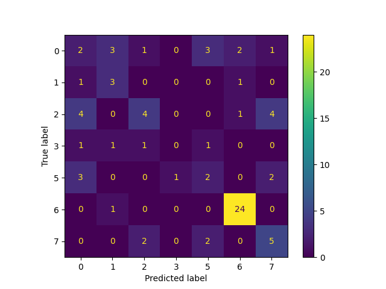

# fast-food

Exploring Fast Food Data and Predicting Restaurants via Nutritional Content

## Results

The best model was Multilayer Perceptron (MLP).

```
              precision    recall  f1-score   support

           0       0.18      0.17      0.17        12
           1       0.38      0.60      0.46         5
           2       0.50      0.31      0.38        13
           3       0.00      0.00      0.00         4
           5       0.25      0.25      0.25         8
           6       0.86      0.96      0.91        25
           7       0.42      0.56      0.48         9

    accuracy                           0.53        76
   macro avg       0.37      0.41      0.38        76
weighted avg       0.50      0.53      0.50        76
```

### Confusion Matrix

The confusion matrix for the MLP results:



## License

[MIT License](LICENSE)
